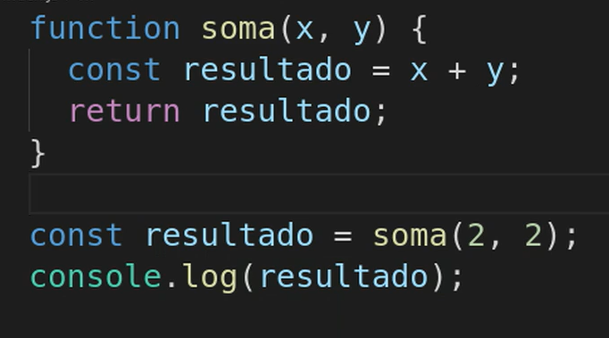

# Funções 

## Funções void

as funções void são o primeiro padrão de função aprendido, funções que não precisam de um parametro, apenas armazenam o código e esperam a hora de serem chamadas

Ex.:
    
    function calculo() {
        let x = 10;
        let y = 20;
        const soma = x + y
        console.log(soma)
    }

Isto é um exemplo de função void aonde o bloco de código foi guardado para ser usado quando necessário, e para usar é simples.
    
    function calculo() {
        let x = 10;
        let y = 20;
        const soma = x + y
        console.log(soma)
    }

    calculo()

Dessa forma a função é chamada, e se quiser passar parâmetros, passa por dentro desses parênteses.

## Funções Retorno 

Funções que possuem parâmetros

uma function com parametro dentro dos parenteses sempre retornará 'undefined' se o return não tiver identificado

    CERTO:

    function nome(name) {
        return Boa noite, ${name}
    }   

    ERRADO: 

    function nome(name) {
        console.log(Boa noite, ${})
    }

pois uma função com parâmetro especificado necessita de um retorno

a função, assim como um bloco de comentário, não é lida pelo javascript, a menos que seja chamada, então variáveis/constantes declaradas dentro do escopo da função podem ser redeclaradas fora da função 

#### Function a partir de variáveis

    const calculo = function(x, y) {

        return x + y
    }

isso é uma forma de criar uma função dentro de uma variável, oque economiza esforço para a manipulação dessas funções, pois somente com um "console.log(calculo(10, 20)) a função ja seria chamada com os parametros passados"

#### Apartir disso surgem as (arrow functions)

## Arrow Functions
São iguais às funções retorno, porém escrita de uma forma mais simples

    const calculo = (x, y) => {
        return x + y
    }

Uma forma mais rápida de criar uma função dentro de uma variável

<strong>Ainda sim possui outra forma de criar Arrow functions</strong>

De uma forma mais simples, para <strong>funções mais simples</strong>

    const calculo = n => `Bom dia, ${n}`

de uma forma bem mais simples é criada uma função retorno com o parametro 'n'.

### Valores em funções

const potencia = (p, n=2) => p ** n

n=2 significa que se o 'n' não receber parâmetros, vai se igualar à 2 

### Formas de colocar uma escuta em uma variável dentro da function

Duas formas conhecidas de colocar uma escuta em uma variável para se comportar de uma forma diferente em decorrência de um evento

        
    form.onsubmit = function (evento) {
        evento.preventDefault();

        alert('vito')
        console.log('foi enviado');
    };
    
form.onsubmit significa que esse bloco de código só será chamado quando o formulario for enviado

Outra forma:

    form.addEventListener('submit', function(event) {
    event.preventDefault();
    });

Forma mais padrão de criar uma escuta