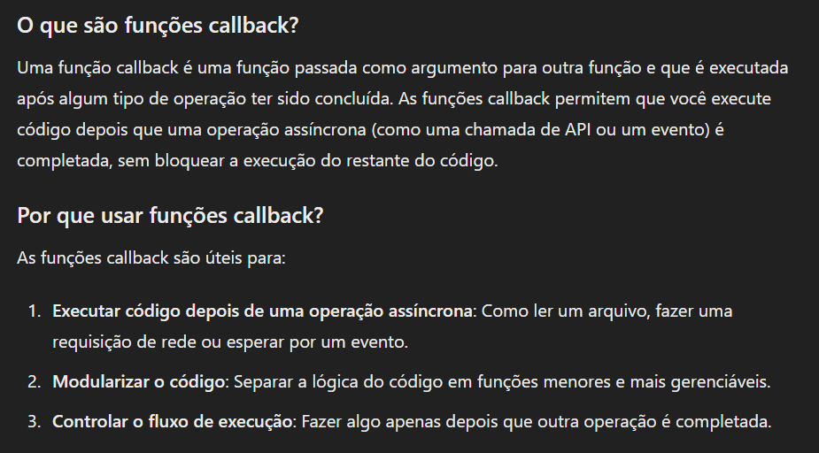

## Funções 3.0

## Closures

As closures é um nome enfeitado para algo simples:

"Uma closure é um escopo de uma função filho em relação à função pai".

Ex.:

    function carro(carro) {
        carro = 'honda civic';
        function novoCarro() {
            carro = 'jeep compass';
        }
        novoCarro();
        return carro;
    }

    É um exemplo de closure.

Percebe-se que na função 'novoCarro', eu estou alterando o valor que foi criado na função pai, pois uma função filho possue 3 escopos.

    Escopo Global: o escopo padrão do JS fora de funções, condições, repetições e qualquer outra coisa

    Escopo de Função: o escopo de dentro de uma função.

    (Esses dois escopos são padrões de qualquer função).

    Closure: O escopo da função filha em relação à função pai

## Callback

Fica mais claro em um exemplo!

Ex.: 

    document.addEventListener('click', function() {
        console.log('callback!');
        carro();
    })

No addEventListener geralmente se é passado uma referência de uma função, porém o callback consiste em criar funções anônimas ao invés de passar argumentos ou referências.

### Exemplos

    function saudação(nome) {
        console.log('Bom dia, ${nome}!');
    }

    function pegarNome(callback) {
        const nome = prompt('Qual seu nome?');
        callback(nome);
    }

    pegarNome(saudação);

Está chamando a função que for enviada como argumento com um parâmetro 'nome' que vai ser exibido pela função, criando assim, um callback.

    function menorOuMaior(idade) {
    if (idade >= 18) {
        return 'maior de idade'
    }
    return 'menor de idade'
    }

    function pegarIdade(callback) {
        const idade = prompt('Qual sua idade?');
        callback(idade);
    }

    pegarIdade(menorOuMaior);

    Segue o mesmo raciocínio.

Também pode ser usado para criar uma sequencia de execução.

    const f1 = callback => console.log('f1');

    const f2 = callback => console.log('f2');

    const f3 = callback => console.log('f3');

    f1(function() {
        f2(function() {
            f3(function() {
                console.log('terminou a sequência');
            })
        })
    })

Dessa forma, as funções serão executadas em uma sequência definida.