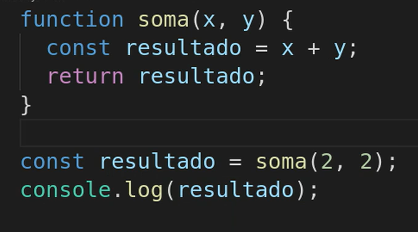

# Funções 

uma function com parametro dentro dos parenteses sempre retornará 'undefined' se o return não tiver identificado

    CERTO:

    function nome(name) {
        return Boa noite, ${name}
    }   

    ERRADO: 

    function nome(name) {
        console.log(Boa noite, ${})
    }

pois uma função com parâmetro especificado necessita de um retorno

a função, assim como um bloco de comentário, não é lida pelo javascript, a menos que seja chamada, então variáveis/constantes declaradas dentro do escopo da função podem ser redeclaradas fora da função 

#### Function a partir de variáveis

    const calculo = function(x, y) {

        return x + y
    }
