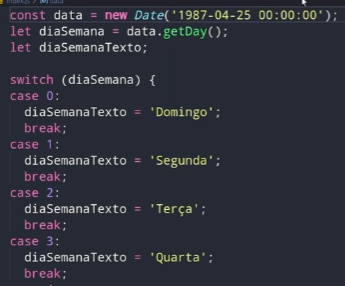

# Switch

dentro dos parênteses do switch entrará a variável

e dentro dos cases o seu valor e a condição que será executada caso tenha aquele valor.

Ex.:

    let victor = 'victor'

    switch (victor) {
    case victor:
        console.log(`o valor é: ${victor} `)
        break
    }

no final de todo case, <strong>é obrigatório um break</strong>. 

Caso não possua esse break, todos os casos serão executados de uma vez