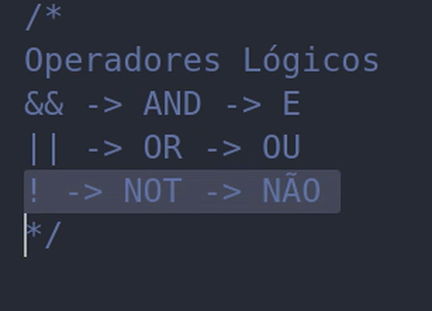

# Operadores 

## Operadores de Comparação

#### (utilizar os operadores estritos)

Ex.:
    
    certo: ===  errado: == 

    certo: !==  errado: !=

pois os estritos analisam <strong>valor e tipo</strong>, já os não estritos só analisam <strong>valor</strong>

    console.log(10 == '10')   
    true

    console.log(10 === '10')
    false

O mesmo vale para o sinal de diferente

## Operadores Lógicos 

Assim como era utilizado nas aulas de probabilidades

### && (e)

    10 + 10 === 20 && 20 - 10 === 10
    true 

Retorna 'true' pois os dois são verdadeiros, se um dos dois for falso, retornará 'false'.

    10 + 10 === 15 && 20 - 10 === 15
    false

As duas sentenças são falsas, então retorna false.

### || (ou)

    10 + 10 === 20 || 20 - 5 === 10
    true 

Retorna true pois um dos dois é verdadeiro, não é necessário que seja os dois, só é preciso que tenha um dos valores verdadeiros para ser considerado true.

    30 - 5 === 25 || 20 - 2 == 18
    true

Com os dois sendo verdadeiros, também retornará true, mas se n houver nenhum verdadeiro, será falso.

    30 - 5 === 20 || 20 - 5 === 15
    false

Pois as duas sequências são falsas.

### ! (não)

Consiste em negar um valor.

    console.log(true)
    true
    
    console.log(!true)
    false

Pois com o NOT(!), você está negando o valor de true, que se tornará falso

Geralmente é utilizado em condicionais, é algo mais simples de ser entendido na prática

## Avaliações em Curto-Circuito

false -> valor literal falso

true -> valor literal verdadeiro 

Outros Valores que avaliam em false.

    0
    '' / ""/ ``
    null / undefined
    NaN

Em caso de strings que não são vazias ou numbers que não são contas/operações

*Se não tiver um elemento que avalia em false, retornará o ultimo elemento que foi checado*

    console.log('victor' && 'alexsa')
    alexsa

*Se tiver um elemento que avalia em false, retornará esse elemento*

    console.log('victor' && NaN && 'alexsa')
    NaN

## Operador ternário

assim como o AND e o OR, pode ser usado em condições

    const idade = 15
    const verificar = idade <= 18? 'sim': 'não'

    console.log(verificar)

oque é posto depois da interrogação são duas condições, essa operação vai retornar um booleano e se ele for verdadeiro, vai retornar o 'sim', se não, vai retornar o não 

