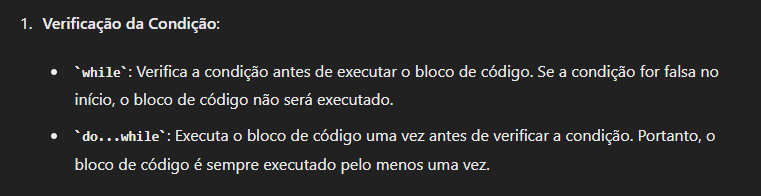
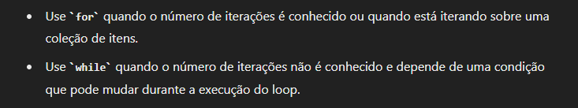
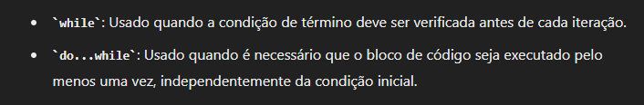

# Estruturas de Repetição.

## For clássico.

O for clássico funciona como um contador, que você passa os parâmetros e ele se realizará oque você mandar

    for(let x = 0;x <= 10; x++) {
        console.log(x)
    }

Um exemplo da sintaxe do for clássico, funciona dessa maneira:

    for (variável;teste lógico;incremento) {

    }

A variável pode ser declarada antes ou até dentro do for. E também podem ser usadas variáveis que ja possuem um valor.

O teste lógico funciona como uma condição para que o loop continue acontecendo.

E o incremento é a forma como o loop irá se comportar, por exemplo:

    x++ significa que a cada sequencia do loop, será adicionado 1 na variável x
    x += 2 adiciona 2
    x-- diminui 1 

    E mais diversas outras maneiras de incrementar.

Também pode ser usado pra navegar em arrays e objetos, mas possui diferentes for para essa função.

    const array = [1 , 2, 3, 4 ,5 ,56];

    for (let contador = 0; contador > array.length; contador++) {
        console.log(array[contador])
    }

Dessa maneira, a variável 'contador' está navegando pelos indices do array e exibindo os dados que estão nesses índices 

## For in.

O for in é utilizado para navegar em objetos e arrays, sendo bem mais simples de ser usado pois não passa o mesmo tanto de parâmetros.

    const objeto = {
        carro: 'gol',
        moto: 'start',
        casa: 'grande',
    }

    for (let contador in objeto) {
        console.log(objeto[contador])
    }

A variável criada dentro do for in terá o valor dos indices do array ou das chaves do objeto, por exemplo:

        const objeto = {
        carro: 'gol',
        moto: 'start',
        casa: 'grande',
    }

    for (let contador in objeto) {
        console.log(contador)
    }

Exibiria as chaves do objeto.

Dessa forma é feito em um objeto, exibindo todos os valores que estão nos devidos índices navegados pela variável 'contador'

    const array = [1,2,3,4,5,6];

    for (let cont in array) {
        console.log(array[cont])
    }

Veja como ficou mais simples de navegar pelo elementos de um array utilizando esse for.

## For of.

### Recapitulando:

o <strong>for clássico</strong> tinha que declarar a variável e passar os parâmetros do valor inicial, do total de dados em (string, array, objeto), e o incremento para que ele navegasse por um array.

o <strong>for in</strong> tinha que declarar a variável, chamar a variável que armazena o dado iterável(string, array, objeto) e colocar a variável do loop dentro do indice da variável do (string, array, objeto)

## Conceito for of.

Já o for of resume isso ainda mais, só necessita de criar a variável do loop, chamar a variável que armazena o dado iterável(string, array) e pronto, mais resumido ainda

## Quando usar qual.

É bastante simples 

### Manipulando Arrays e Objetos.

No array e no objeto possuímos dois feitos para facilitar nossa vida

    For in e For of

Dependem da circunstância para serem usados:

    Se vai precisar do índice:

    For in

    Se não vai:

    For of

Além do for clássico que também pode ser usado tranquilamente para qualquer circunstância.

Simples assim!

## Exceção

O for of não vai funcionar pro objeto pois ele não é iterável (não possui indices, e sim chaves)

## While.

O while é uma estrutura de repetição que é ativada apartir de um booleano e geralmente é usada quando não se sabe o tanto de vezes que se repetirá e quando não se está manipulando um array ou objeto.

Já que,enquanto no for o final do loop é declarado no começo, o while pode apresentar uma condição e não parar até ela ser verdadeira.

    let contador = 0;

    while (contador < 5) {
        console.log(contador);
        contador++;
    }

<strong>Verificará se a condição é verdadeira, e enquanto for verdadeira</strong>, Acrescentará 1 e mostrará na tela, <strong>até que a condição passe a ser falsa</strong>.

    let rand = 10;

    while (rand !== 10) {
        rand = random(min,max)
        console.log(rand);
        
    }

    Mesmo que o valor de rand foi alterado, o laço não será executado pois a condição foi checada no valor da variável e deu false

Mas o <strong>Do while</strong> executaria, pois ele ia substituir o valor do rand para depois checar a condição.

## Do while.

O do while muda pouca coisa do while, <strong>pois o while primeiro checa a condição, para depois executar</strong> já o <strong>do while primeiro executa para depois checar a condição</strong>.

Ex.:

    contador = 10;

    while (contador > 10) {
        console.log(contador)
        contador++;
    }

    Esse código não exibirá nada, pois a condição é falsa desde o início

Porém no do while exibirá algo

    do {
        contador++;
        console.log(contador);
    } while (contador > 10);

    Esse código exibirá 10

Pois já que o do while executa para depois verificar, ele executa o console.log para depois verificar e sair do loop

## Quando usar.

### For ou While?

### While ou Do while?

