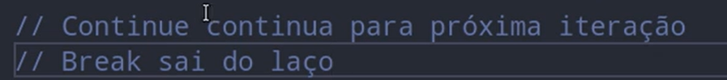

## Break e Continue

### Continue

Pula as linhas de código que você não quer que sejam executadas.

    const numeros = [1,2,3,4,5,6,7,8];

    for (numero of numeros) {

        if (numero === 2) {
            continue;
        }
        console.log(numero);

    }

Dessa forma, o numero 2 será ignorado.

Também pode ser feito dessa forma:

        const numeros = [1,2,3,4,5,6,7,8];

    for (numero of numeros) {

        if (numero === 2) {
            continue;
        }
        if (numero === 5) {
            continue;
        }
        if (numero === 7 || numero === 8) {
            continue;
        }
        console.log(numero);

    }

Assim os números: 2, 5, 7 e 8 serão ignorados.

### Break.

O break existe no switch e tem a mesma função em outros blocos de código.

diferentemente do continue que ignora oque está abaixo e roda o resto do código, o break instantaneamente sai do bloco.

    const numeros = [1,2,3,4,5,6,7,8];

    for (numero of numeros) {

        if (numero === 4) {
            break;
            const macaco = 'macaco';
            console.log(macaco);
        }

        if (numero === 2) {
            continue;
        }
        if (numero === 5) {
            continue;
        }
        if (numero === 7 || numero === 8) {
            continue;
        }
        console.log(numero);

    }

    Nada além do break será executado pois ele sai do bloco do if.

## Diferenças.

Enquanto o continue somente ignora oque está abaixo dele, mas continua executando, já o break sai dos blocos de código.

## Cuidados

Ao usar o continue ou break em um 'while' ou 'do while', adicionar o incremento sempre no inicio do bloco de código ou antes desses comandos, pois se o continue for executado, o valor da variável de controle não vai ser atualizado, gerando um <strong>loop infinito</strong>

