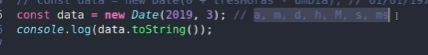

# Date

o objeto 'Date()' extrai as horas do sistema operacional do usuário.

Possui inúmeros métodos, alguns deles como:

    getFullYear
    getMonth
    getDate
    getHours
    getMinutes
    getSeconds
    getMilliseconds

Que extraem o ano, o mês, o dia, as horas, minutos, segundos e milisegundos da data.

OBS.:

    getDate() !== getDay()

    getDay() -> extrai o dia da semana!

    Ano, mês, hora, minuto, segundo, milisegundo

a data também pode ser definida dessa forma.

Também pode ser formatada de outra forma.

    const data = new Date('2023-08-15 18:30:25');

    ou

    const data = new Date('2023-08-15T18:30:25');

A data também pode ser passada para string.

    const data = new Date();
    const transformar = data.toString();