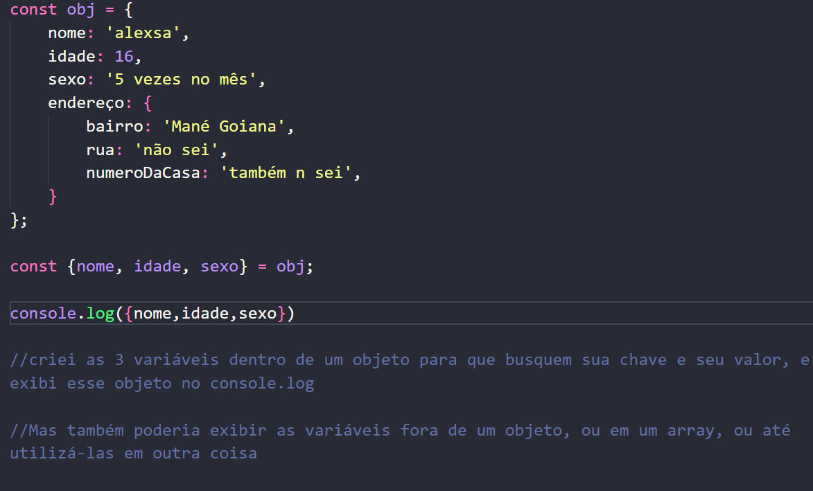

# Objetos

## Sobre objetos

### Conceitos

Os objetos não podem ser manipulados com 'push, pop, shift, unshift ou slice'

Ou seja, a única forma de alterar dados dentro de um objeto é uma função ou trocando manualmente esse objeto.

um objeto possui a mesma estrutura de um array, porém feito em chaves

E cada elemento posto possui um atributo, como um dado 

como por exemplo na constante obj, que possui o nome 'Alexsa', o sobrenome 'Martins' e a idade 16

foi criada essa arrow function que retorna um objeto com os argumentos lançados junto com a chamada da função 

    const funcaoObjeto = (nome, sobrenome, idade) => {
    return {
        nome,
        sobrenome,
        idade,
    }

    }

também pode ser escrito dessa forma

<strong>Objetos podem conter funções, Assim como os arrays</strong>

funções que são criadas sem a palavra function e são utilizadas como um método

    const obj = {
        nome:'vito',
        sobrenome:'arruda'
        idade:17,

        teste() {
            console.log('pegou');
        }
    }
    obj.teste();

Mesmo que tenha como ser feito em arrays e objetos, geralmente não tem porque utilizar isso 

Nos objetos também podem ser criados outros objetos, assim como no array.

Ex.:

    const obj = {
        nome: 'alexsa',
        idade: 16,
        sexo: '5 vezes no mês',
        endereço: {
            bairro: 'Mané Goiana',
            rua: 'não sei'
            numero da casa: 'também n sei',
        }
    }
    dentro do objeto de nome 'obj', possui outro objeto de nome 'endereço'

## Atribuição via desestruturação.

A atribuição de um objeto é muito mais simples, pois podemos chamar a chave para buscar o valor 

    const nome = obj.nome;

    Dessa forma

Mas existe outra forma de armazenar esses dados, dessa forma:

Essa forma também pode ser feitas no array, mas como o array não possui chaves, ele possui uma sintaxe diferente.

Mas essa forma não serve somente para buscar as chaves e armazenar os dados, também serve para alterar os dados dentro das chaves.

