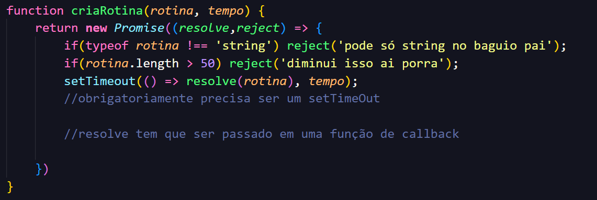

## Funções Assíncronas

A função assíncrona funciona assim como a função de callback e a promisse, permite criar uma ordem de execução, criando organização e tratamento melhor de erros entre funções mais demoradas e funções mais rápidas

Os 3 conceitos dependem um do outro.

para a função assíncrona funcionar, é necessário uma promise, para a promisse funcionar, é preciso de uma callback function dentro do setTimeout

## Sintaxe 

Para a função assíncrona funcionar, é obrigatório ter a palavra *async* antes da função.

    async function() {

    }

    Dessa forma

E dentro da função assíncrona