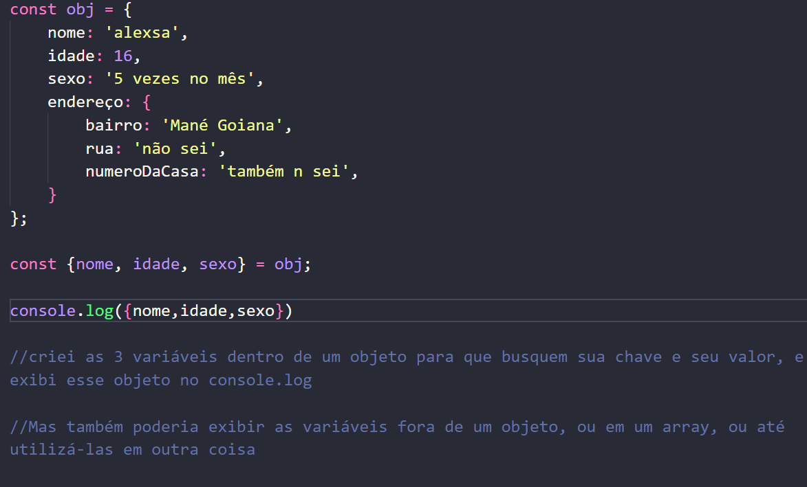

# Objetos

## Sobre objetos

### Conceitos

Os objetos não podem ser manipulados com 'push, pop, shift, unshift ou slice'

Ou seja, a única forma de alterar dados dentro de um objeto é uma função ou trocando manualmente esse objeto.

um objeto possui a mesma estrutura de um array, porém feito em chaves

E cada elemento posto possui um atributo, como um dado 

como por exemplo na constante obj, que possui o nome 'Alexsa', o sobrenome 'Martins' e a idade 16

foi criada essa arrow function que retorna um objeto com os argumentos lançados junto com a chamada da função 

    const funcaoObjeto = (nome, sobrenome, idade) => {
    return {
        nome,
        sobrenome,
        idade,
    }

    }

também pode ser escrito dessa forma

<strong>Objetos podem conter funções, Assim como os arrays</strong>

funções que são criadas sem a palavra function e são utilizadas como um método

    const obj = {
        nome:'vito',
        sobrenome:'arruda'
        idade:17,

        teste() {
            console.log('pegou');
        }
    }
    obj.teste();

Mesmo que tenha como ser feito em arrays e objetos, geralmente não tem porque utilizar isso 

Nos objetos também podem ser criados outros objetos, assim como no array.

Ex.:

    const obj = {
        nome: 'alexsa',
        idade: 16,
        sexo: '5 vezes no mês',
        endereço: {
            bairro: 'Mané Goiana',
            rua: 'não sei'
            numero da casa: 'também n sei',
        }
    }
    dentro do objeto de nome 'obj', possui outro objeto de nome 'endereço'

## Atribuição via desestruturação.

A atribuição de um objeto é muito mais simples, pois podemos chamar a chave para buscar o valor 

    const nome = obj.nome;

    Dessa forma

Mas existe outra forma de armazenar esses dados, dessa forma:

Essa forma também pode ser feitas no array, mas como o array não possui chaves, ele possui uma sintaxe diferente.

Mas essa forma não serve somente para buscar as chaves e armazenar os dados, também serve para alterar os dados dentro das chaves.

    const obj = {
        nome: 'victor',
        sobrenome:'arruda',
    }

    const {nome: a = 'alexsa', sobrenome: sn = 'martins'} = obj;

Dessa forma, eu to pegando a chave, alterando o valor dado no objeto e armazenando nas variáveis (a e sn)

Também é possivel criar um objeto dentro do outro dentro dessa atribuição

Dessa forma:

    const objeto = {
        endereco: {
            rua: r = 'exemplo',
            numero,
        }
    }

Dessa maneira, é criado um objeto dentro do outro.

Assim como no array, também pode ser utilizado o operador (...) para pegar o resto

    const obj = {
        nome: 'alexsa',
        sobrenome: 'martins',
        idade: 16,
        estadoCivil: 'namorando',
    }

    const {nome, ...resto} = obj;

    console.log(resto)

O operador indica que oq sobrou do objeto vai ser armazenado na variável 'resto'.

### OBS.:

Existe outra forma de acessar o valor do objeto através da chave

Ao invés de:

    const pessoa = {
        nome: 'victor',
        sobrenome: 'de lexsa',
        idade: 16,
    }

    console.log(pessoa.nome);

Pode-se usar:

    console.log(pessoa['nome'])

Funciona da mesma forma, mas essa forma é mais util para utilizar no 'for in'

