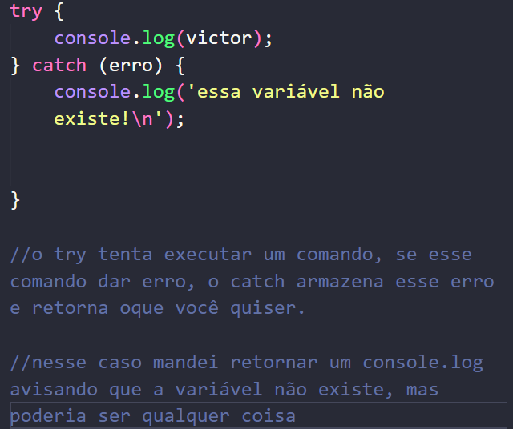

## Try e Catch.

Exemplo de try catch.

try => tentar
catch => capturar

o comando deu erro pois essa variável não existe.

<strong>Geralmente o catch é utilizado para resolver o problema ou alertar sobre ele</strong>

## Throw 

throw => lançar

Lança um erro, que é armazenado pelo parâmetro do catch, já que ele armazena erros do try e do throw.

Existem diversos tipos de erros que podem ser enviados no throw

Tanto uma string:

    throw('ERRO!');

Como um erro existente no JS (não recomendado no front-end)

    Error();
    ReferenceError(); (padrão do JS)

    São funções que representam erros do JavaScript que podem ser usadas.

Porém não é legal lançar um erro desse para o usuário, pois o usuário obviamente não entenderia oque está acontecendo.

    throw new ReferenceError('Esse email ja foi cadastrado em outra conta.');

    throw new Error('Esse usuário já existe.');

    Exemplo para mostrar a sintaxe do erro, não vai ser usado assim em um caso real

### Resumindo.

Usar as funções do JavaScript para lançar erros, porém não exibir esses erros para o usuário, exibir algo mais simples e de maior entendimento através do catch.

